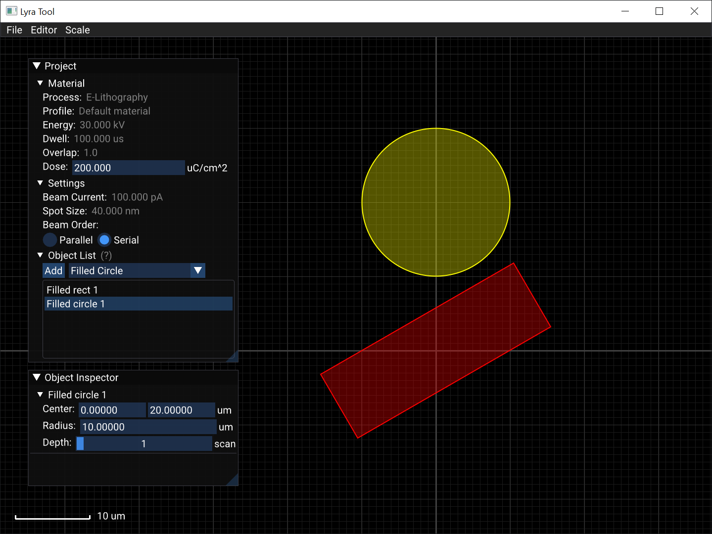

# Lyra Tool
Open source tool for modifying TESCAN Lyra Project files.

------------------------------

## Features
* Supports editing nearly all shape types in LyraTC DrawBeam Project `.xml` files.

------------------------------

## Installation
* Clone the project or download the zipped source (ideally from a tagged release).
* Open a terminal and navigate to the project directory.
* Run `pip install -r requirements.txt`.
* (Ubuntu) Install `tkinter` using `apt install python3-tk`.
* Run `python3 app.py`.